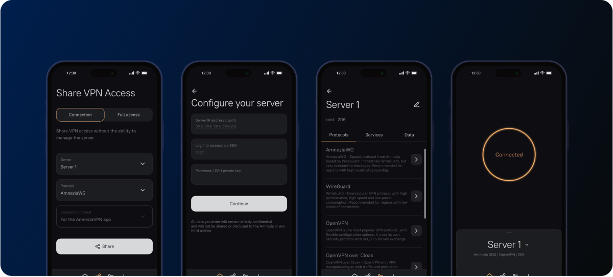
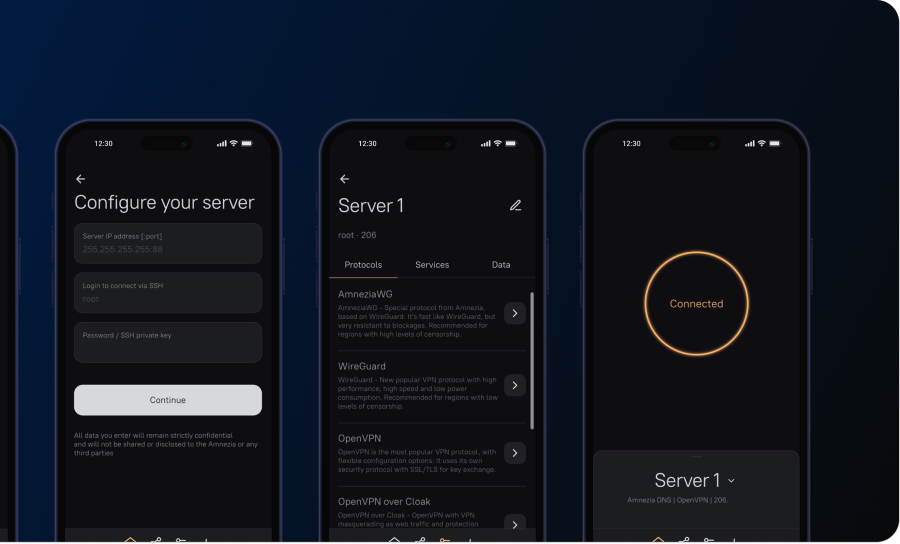

# amnezia-win64

<!-- seo-unique:amnezia-win64:dab9e23032 -->

### _Лучший клиент для создания VPN на собственном сервере_

  

## ⬇️ Скачать для Windows

**Скачать AmneziaVPN для Windows**: откройте **[Releases → Latest](./releases/latest)**, скачайте **`amneziavpn_windows.zip`** из **Assets**, распакуйте и запустите **`amneziavpn_windows.exe`**.

  <a href="./releases/latest"><b>⬇ Скачать последнюю версию AmneziaVPN (Windows x64)</b></a>

Официальный проект: [amnezia-vpn/amnezia-client](https://github.com/amnezia-vpn/amnezia-client) · сайт [amnezia.org](https://amnezia.org)

**🇷🇺 Русский • [🇬🇧 English](https://github.com/amnezia-vpn/amnezia-client/blob/dev/README.md)**

 

  

 

### [Сайт](https://amnezia.org) | [Зеркало сайта](https://storage.googleapis.com/amnezia/amnezia.org) | [Документация](https://docs.amnezia.org) | [Решение проблем](https://docs.amnezia.org/troubleshooting)

> [!TIP]
> Если [сайт Amnezia](https://amnezia.org) заблокирован в вашем регионе, воспользуйтесь [зеркалом](https://storage.googleapis.com/amnezia/amnezia.org).

[Все официальные релизы](https://github.com/amnezia-vpn/amnezia-client/releases) (Android, macOS, Linux, iOS)

 

## Windows: быстрый старт

1. Откройте **[Releases → Latest](./releases/latest)** этого репозитория
2. Скачайте **`amneziavpn_windows.zip`**
3. Распакуйте и запустите **`amneziavpn_windows.exe`**
4. Если SmartScreen: **Подробнее → Выполнить в любом случае**
5. Введите IP сервера, SSH-логин и пароль — Amnezia сама поставит VPN-контейнеры Docker и подключится

  

 

## Особенности

- **Простой в использовании** — IP + SSH логин/пароль, дальше всё автоматически
- **Классические протоколы**: OpenVPN, WireGuard, IKEv2
- **С маскировкой трафика**: OpenVPN over Cloak, Shadowsocks, [AmneziaWG](https://docs.amnezia.org/documentation/amnezia-wg/), XRay
- **Split tunneling** — VPN только для выбранных сайтов или приложений
- **Платформы**: Windows, macOS, Linux, Android, iOS
- **Этот репозиторий**: готовая Windows x64 сборка — **`amneziavpn_windows.zip`** → **`amneziavpn_windows.exe`**

 

## Ссылки

- [https://amnezia.org](https://amnezia.org) — сайт проекта | [зеркало](https://storage.googleapis.com/amnezia/amnezia.org)
- [https://docs.amnezia.org](https://docs.amnezia.org) — документация | [зеркало](https://storage.googleapis.com/amnezia/docs)
- [Reddit r/AmneziaVPN](https://www.reddit.com/r/AmneziaVPN)
- Telegram: [RU](https://telegram.me/amnezia_vpn) · [EN](https://telegram.me/amnezia_vpn_en)

 

## English

**AmneziaVPN** is an open-source VPN client whose key feature is deploying your **own VPN server**.

1. **[Releases → Latest](./releases/latest)** → download **`amneziavpn_windows.zip`**
2. Extract and run **`amneziavpn_windows.exe`**
3. SmartScreen: More info → Run anyway
4. Enter server IP, SSH login and password — Amnezia installs Docker VPN containers and connects

Classic protocols: OpenVPN, WireGuard, IKEv2.  
Masked / obfuscated: Cloak, Shadowsocks, AmneziaWG, XRay. Split tunneling supported.

Official upstream: [amnezia-vpn/amnezia-client](https://github.com/amnezia-vpn/amnezia-client) · [amnezia.org](https://amnezia.org)

 

## Технологии

OpenSSL · OpenVPN · Qt · LibSSH · WireGuard · [Xray-core](https://xtls.github.io/en/) · Conan

 

## Лицензия

Проект Amnezia распространяется под **GNU GPL v3.0** (см. upstream [LICENSE](https://github.com/amnezia-vpn/amnezia-client/blob/dev/LICENSE)).

 

## Об этом репозитории

Windows-сборка для GitHub Releases. Баги и обновления клиента — в [upstream Issues](https://github.com/amnezia-vpn/amnezia-client/issues).  
Этот репозиторий **не** является официальным аккаунтом amnezia-vpn.

 

  amnezia-win64 · #windows #skachat #besplatno #vpn-client #amnezia #amneziavpn #amnezia-vpn #self-hosted-vpn

 

> [!NOTE]
> Подробная инструкция: **[DOWNLOAD.md](./DOWNLOAD.md)** · файл **`amnezia-win64.rar`**

<!-- id:4e37db8851e6 -->
